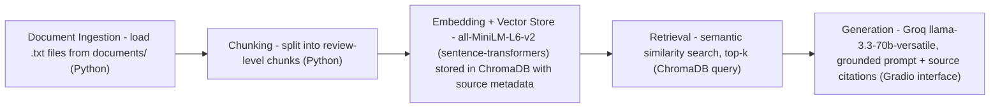

# Project 1 Planning: The Unofficial Guide

---

## Domain

My domain is student reviews of Computer Science professors at the College of
Staten Island (CUNY). This knowledge is valuable because choosing the right
professor has a big impact on how well you learn and what grade you get, but
it's hard to find through official channels — CSI's website only lists course
descriptions and faculty bios, and says nothing about which professors explain
things clearly, how hard their exams are, whether they curve, or if attendance
matters. Students share that information in Rate My Professors reviews, and my
system makes it searchable and answerable in plain language.

---

## Documents

All documents are Rate My Professors review pages for CSI Computer Science
professors. I copied the written review text from each professor's page into a
.txt file in the documents/ folder (RMP blocks scraping, so manual copying was
used, as the project instructions allow).

| # | Source | Description | URL or location |
|---|--------|-------------|-----------------|
| 1 | rmp_zelikovitz.txt | Sarah Zelikovitz reviews | |
| 2 | rmp_zhang_shuqun.txt | Shuqun Zhang reviews | https://www.ratemyprofessors.com/professor/339313 |
| 3 | rmp_rao.txt | Jun Rao reviews | https://www.ratemyprofessors.com/professor/2714425 |
| 4 | rmp_mohamed.txt | Ali Mohamed reviews |  |
| 5 | rmp_chen.txt | Cong Chen reviews | https://www.ratemyprofessors.com/professor/2805649 |
| 6 | rmp_zhang_xiaowen.txt | Xiaowen (Sean) Zhang reviews |  |
| 7 | rmp_deredita.txt | Michael D'eredita reviews ||
| 8 | rmp_wang.txt | Zhiqi Wang reviews | https://www.ratemyprofessors.com/professor/2848506 |
| 9 | rmp_alnajjar.txt | Fuad Alnajjar reviews |  |
| 10 | rmp_petingi.txt | Louis Petingi reviews |  |

---

## Chunking Strategy

**Chunk size:** One review per chunk (roughly 100–400 characters each).

**Overlap:** None, because each review is independent of the others.

**Reasoning:** My documents are lists of short student reviews, so I split at
review boundaries instead of a fixed character count. A fixed size like 500
characters would cut reviews in the middle, creating fragments that don't
match queries well. Since many reviews don't mention the professor by name, my
chunking code will also prepend the professor's name from each file's header
line to every chunk, so every chunk can stand alone and be attributed to the
right person.

---

## Retrieval Approach

**Embedding model:** all-MiniLM-L6-v2 via sentence-transformers (runs locally,
no API key or rate limits).

**Top-k:** 5. Retrieving only 1 chunk risks missing relevant reviews since
opinions are spread across many reviews; retrieving 10+ would pull in loosely
related reviews about other professors and could pull the answer off-target.

**Production tradeoff reflection:** For real users I would weigh: (1) accuracy
on informal text — student reviews are full of slang, typos, and
abbreviations, so a model trained on informal text could retrieve more
accurately; (2) local vs. API — an API model may be more accurate but adds
cost and per-query latency, while a local model is free and private.

---

## Evaluation Plan

| # | Question | Expected answer |
|---|----------|-----------------|
| 1 | Does Professor Shuqun Zhang help students during labs? | Yes — multiple reviews say he helps during lab sessions and stays after class to help students finish. |
| 2 | Do students think Professor Fuad Alnajjar's positive reviews are trustworthy? | Mixed — most reviews are very positive (clear explanations, real-world examples, fair grading), but one review claims the positive reviews were written by the professor himself. |
| 3 | Does Professor Shuqun Zhang give practice exams? | Yes — a review says he does reviews before all exams and gives practice exams. |
| 4 | ❗YOUR QUESTION from rmp_rao.txt | ❗What the reviews actually say |
| 5 | Where can I park near the CS building at CSI? | The system should say it doesn't have enough information — parking is not covered in any document. |

---

## Anticipated Challenges

1. **Two professors named Zhang.** My documents include Shuqun Zhang and
   Xiaowen (Sean) Zhang. A query like "Is Professor Zhang a good teacher?" is
   ambiguous — retrieval could mix reviews of both professors into one answer.
   I will test this and it may become my documented failure case.

2. **Unreliable review content.** One review in my corpus claims a professor's
   positive reviews were written by the professor himself. My system retrieves
   and summarizes what reviews say — it cannot verify whether reviews are
   true, so answers reflect student opinion, not verified fact.

3. **Uneven coverage.** Some professors have 50+ reviews while others have
   very few. Questions about low-coverage professors may retrieve chunks from
   other professors instead, because there isn't enough relevant material.

---

## Architecture

---

## AI Tool Plan

**Milestone 3 — Ingestion and chunking:** I will give Claude my Chunking
Strategy and Documents sections plus my architecture diagram, and ask it to
write a Python script that loads all .txt files from documents/, splits each
file into one chunk per review, and prepends the professor's name from each
file's header. I will verify by printing 5 chunks and checking each one is
complete, named, and matches my spec.

**Milestone 4 — Embedding and retrieval:** I will give Claude my Retrieval
Approach section and ask it to embed the chunks with all-MiniLM-L6-v2, store
them in ChromaDB with the source filename as metadata, and write a retrieval
function returning the top-5 chunks. I will verify by running 3 of my
evaluation questions and checking the returned chunks are relevant with
distance scores below 0.5.

**Milestone 5 — Generation and interface:** I will give Claude my grounding
requirement and ask it to write a Groq (llama-3.3-70b-versatile) call whose
prompt instructs the model to answer ONLY from retrieved chunks and to say "I
don't have enough information" otherwise, plus a Gradio interface showing the
answer and sources. I will verify by asking my out-of-scope parking question
and checking the system refuses instead of making something up.
